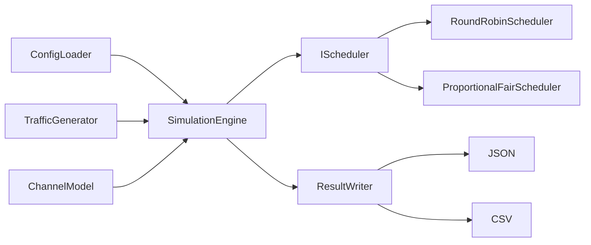
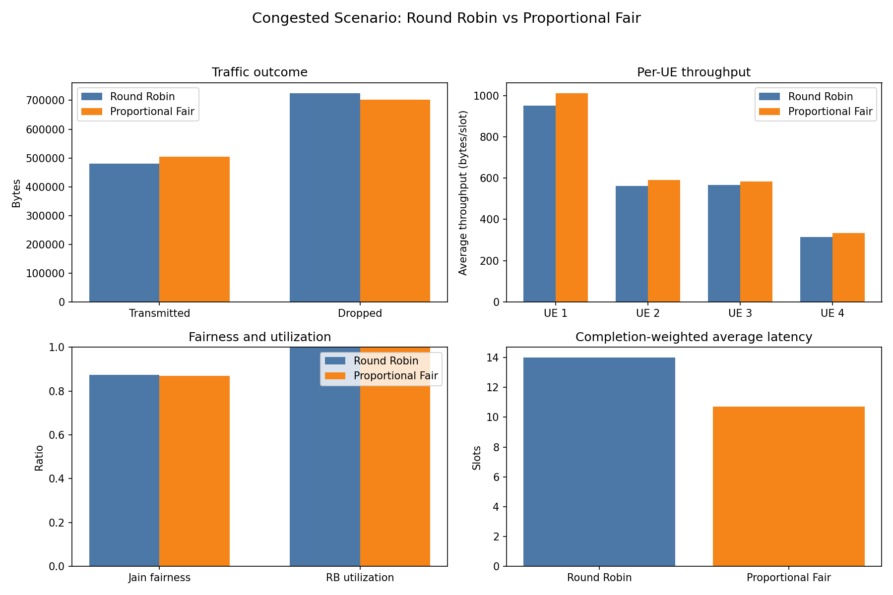

# 5G RAN Scheduling and Test Automation Simulator

[](https://github.com/srikar0313/5g-ran-scheduler-simulator/actions/workflows/ci.yml)

This completed educational prototype models a simplified radio scheduler in modern
C++20. It connects configurable traffic and channel models to Round Robin and
Proportional Fair scheduling, then exports deterministic metrics for automated testing
and visualization.

> This is a simplified learning project, not a standards-compliant 3GPP implementation.

## Key Features

- JSON-configured simulations with deterministic random seeds.
- FIFO packet queues, partial transmission, latency deadlines, and packet drops.
- Periodic, Bernoulli, and disabled traffic generators.
- Static, trace-based, and bounded random-walk CQI models.
- Interchangeable Round Robin and Proportional Fair schedulers through `IScheduler`.
- Per-slot and per-UE throughput, latency, drop, utilization, and fairness metrics.
- Deterministic JSON and CSV result files.
- GoogleTest unit tests and Java 21/JUnit black-box integration tests.
- GitHub Actions CI and a Matplotlib scheduler-comparison tool.

## What The Simulator Demonstrates

The project demonstrates how traffic demand, channel quality, packet deadlines, and a
scheduler's policy interact under a limited resource-block budget. Round Robin rotates
service among active UEs without considering channel quality, while Proportional Fair
balances current CQI opportunity against historical throughput.

The deterministic model makes those policy differences reproducible and testable. It is
designed to explain software structure and scheduling tradeoffs, not to predict real
network performance.

## Architecture

The implementation keeps configuration, models, scheduling decisions, simulation
coordination, metrics, and result writing separate:



`Packet` and `UserEquipment` own queue state. Schedulers receive read-only
`UeSchedulingView` values and return allocation decisions; `SimulationEngine`
validates and applies those decisions.

## Simulation Flow

For every time slot, the engine performs these operations in order:

1. Generate packets for each UE and add them to its queue.
2. Remove packets that have reached their latency deadline.
3. Update each UE's CQI from its channel model.
4. Build scheduling views and request resource allocations.
5. Validate every allocation before applying any of them.
6. Transmit bytes using the allocated resource blocks and current CQI.
7. Update each UE's historical average throughput.
8. Record per-UE and per-slot metrics.

Transmission capacity uses:

```text
bytes per resource block = CQI * 100
byte capacity = allocated resource blocks * bytes per resource block
```

A packet expires when:

```text
current slot >= arrival slot + latency budget slots
```

Completed-packet latency includes both endpoint slots:

```text
latency = completion slot - arrival slot + 1
```

## Schedulers

### Round Robin

`RoundRobinScheduler` allocates one useful resource block at a time in stable UE order.
Its cursor continues across slots, skips empty queues, and prevents a low-capacity slot
from always starting with the first UE. It does not use CQI or throughput history when
choosing which active UE is next.

### Proportional Fair

`ProportionalFairScheduler` scores eligible UEs with:

```text
PF metric = bytesPerResourceBlock(CQI)
            / max(historical average throughput, epsilon)
```

Higher CQI raises the current opportunity, while previously received throughput lowers
priority. The engine, not the scheduler, updates the history after each slot:

```text
T(t) = 0.9 * T(t-1) + 0.1 * transmittedBytes(t)
```

Equal scores prefer the UE with fewer allocations in the current call, then the lower
UE ID, which keeps results deterministic.

## Quick Start

Prerequisites:

- CMake 3.24 or newer
- A C++20 compiler
- Python 3 for scheduler comparison
- Java 21 and Maven 3 for integration tests

Build and run:

```bash
cmake -S . -B build
cmake --build build --parallel

./build/ran_scheduler \
  --config configs/basic.json \
  --scheduler round-robin \
  --output-dir results/basic
```

`--config` is required. The scheduler defaults to `round-robin`, and the output
directory defaults to `results`. Run `./build/ran_scheduler --help` for the complete
CLI summary.

## Configuration Example

Configurations define global simulation settings and a list of UEs. This shortened
example uses periodic traffic and a bounded random-walk channel:

```json
{
  "simulation": {
    "time_slots": 200,
    "slot_duration_ms": 1.0,
    "resource_blocks_per_slot": 3,
    "random_seed": 2026
  },
  "ues": [
    {
      "id": 1,
      "priority": 1,
      "initial_cqi": 12,
      "traffic": {
        "model": "periodic",
        "packet_size_bytes": 2400,
        "latency_budget_slots": 5,
        "period_slots": 1,
        "category": "voice"
      },
      "channel": {
        "model": "random_walk",
        "min_cqi": 6,
        "max_cqi": 15
      }
    }
  ]
}
```

See `configs/` for complete examples. Traffic categories and values are synthetic
educational inputs, not standardized QoS profiles.

## Comparing Schedulers

Install the visualization dependency and run both schedulers against the congested
scenario:

```bash
python3 -m pip install -r scripts/requirements.txt

python3 scripts/compare_schedulers.py \
  --executable ./build/ran_scheduler \
  --config configs/congested.json \
  --output-dir results/comparison
```

The script prints a concise table and creates:

```text
results/comparison/
├── round-robin/
│   ├── summary.json
│   ├── per_ue.csv
│   └── per_slot.csv
├── proportional-fair/
│   ├── summary.json
│   ├── per_ue.csv
│   └── per_slot.csv
├── comparison.csv
└── scheduler_comparison.png
```

## Actual Congested-Scenario Results

`configs/congested.json` runs 200 slots with four periodic UEs, distinct initial CQIs
and channel ranges, and only three resource blocks per slot. Offered demand exceeds
available capacity. The following values were generated by the comparison script;
ratios and latency are rounded for display.

| Scheduler | Transmitted bytes | Dropped bytes | Completed packets | Avg completed latency | Jain fairness | RB utilization |
|---|---:|---:|---:|---:|---:|---:|
| Round Robin | 479,600 | 724,900 | 65 | 14.000 slots | 0.8736 | 1.0000 |
| Proportional Fair | 504,300 | 701,700 | 241 | 10.701 slots | 0.8701 | 1.0000 |



In this specific run, Proportional Fair transmitted 24,700 more bytes and dropped
23,200 fewer bytes. Its completion-weighted latency was lower and it completed more
packets, while Round Robin's Jain fairness index was slightly higher. Both schedulers
used every available resource block.

PF could favor useful channel opportunities as deterministic CQI values changed, while
its historical-throughput denominator still reduced priority for recently served UEs.
Round Robin continued rotating without considering CQI. These results describe only
this synthetic scenario; they do not show that either scheduler is universally better.
Exact values, including per-UE throughput, are in
[`docs/comparison.csv`](docs/comparison.csv).

## Result Files And Metrics

Each simulator run writes:

- `summary.json`: overall metrics and a per-UE metrics array.
- `per_ue.csv`: one accumulated and derived metrics row per UE.
- `per_slot.csv`: generated, transmitted, and dropped bytes plus allocated RBs per slot.

Per-UE metrics include generated/completed/dropped packet counts, byte totals,
allocated resource blocks, average throughput in bytes per slot, average completed
latency, and nearest-rank 95th-percentile latency.

Overall metrics include transmitted and dropped bytes, allocated and available resource
blocks, resource-block utilization, and Jain's fairness index based on per-UE average
throughput. Latency values are zero when no packets complete, and fairness is zero when
all UEs have zero throughput.

## Testing And CI

C++ unit tests exercise individual models, schedulers, validation rules, metrics, the
simulation engine, and result writing:

```bash
ctest --test-dir build --output-on-failure
```

Java integration tests launch the complete executable as an external process and verify
help text, both schedulers, generated files, deterministic output, and CLI errors:

```bash
mvn -B -f integration-tests/pom.xml test \
  -Dran.executable="$(pwd)/build/ran_scheduler" \
  -Dran.repository.root="$(pwd)"
```

The [CI workflow](.github/workflows/ci.yml) performs the C++ build, C++ tests, and Java
integration tests on pushes to `main` and pull requests targeting `main`.

## Project Structure

```text
.github/workflows/   GitHub Actions CI
cmake/               Compiler warnings and sanitizer options
configs/             Reproducible simulation scenarios
docs/                Committed comparison artifacts
include/ran/         Public C++ interfaces
integration-tests/   Java 21/JUnit black-box tests
scripts/             Python comparison and visualization
src/                 C++ implementation and CLI
tests/               GoogleTest unit tests
```

## Engineering Highlights

- C++20 component-based simulator with value-owning packet and UE state.
- Interchangeable schedulers behind the small `IScheduler` interface.
- Deterministic traffic and channel simulation from configuration seeds.
- FIFO queues with partial transmission and latency-deadline drops.
- Throughput, latency, resource utilization, and Jain fairness metrics.
- GoogleTest coverage for components and simulation behavior.
- Java 21/JUnit end-to-end process testing.
- GitHub Actions build and test automation.
- JSON/CSV outputs and headless Python/Matplotlib visualization.

## Limitations

- This is a simplified educational simulator and is not 3GPP-compliant.
- The `CQI * 100` byte-capacity rule is not a transport-block calculation or physical
  layer model.
- Traffic categories, arrivals, packet sizes, CQI traces, and random walks are synthetic.
- The schedulers omit many concerns present in deployed RAN systems.
- Results should not be treated as network-performance benchmarks.
- No proprietary Ericsson source code, data, algorithms, documentation, interfaces, or
  implementation details are used.

## Possible Future Improvements

- Add more configurable channel traces and traffic scenarios.
- Model retransmissions and richer packet-priority policies.
- Add another educational scheduling strategy for comparison.
- Export time-series plots for queue depth and per-slot throughput.
- Replace the linear CQI capacity rule with a documented research model.
