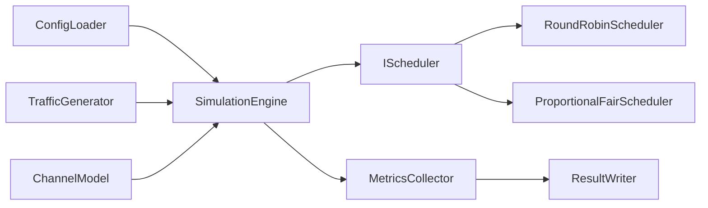

# 5G RAN Scheduling and Test Automation Simulator

This repository is an incremental portfolio project for practicing modern C++20,
Linux-compatible builds, automated testing, and CI/CD around simplified RAN L2/MAC
scheduling concepts.

> Educational limitation: this is a simplified simulator for learning and interview
> discussion. It is not a complete RAN implementation and is not 3GPP-compliant.

No proprietary Ericsson source code, algorithms, documentation, interfaces, or data are
used in this project.

## Current Phase

Phase 6 is complete. The project now includes value-owning packet and UE queue models,
traffic generation, channel models, JSON configuration, and both Round-Robin and
simplified Proportional-Fair scheduling decisions. The CLI validates a configuration and
prints a short summary; it does not run the models or schedulers.

Applying scheduler decisions, packet transmission through a simulation engine, metrics,
result files, Java integration tests, and CI are not implemented yet.

## Build And Test

```bash
cmake -S . -B build
cmake --build build
ctest --test-dir build --output-on-failure
./build/ran_scheduler --help
./build/ran_scheduler --config configs/basic.json
./build/ran_scheduler --config configs/seeded_models.json
./build/ran_scheduler --config configs/temporary_poor_channel.json
./build/ran_scheduler --config configs/no_traffic.json
```

Optional sanitizer build on compatible GCC/Clang environments:

```bash
cmake -S . -B build-sanitized -DRAN_ENABLE_SANITIZERS=ON
cmake --build build-sanitized
ctest --test-dir build-sanitized --output-on-failure
```

## Current Models

`Packet` tracks a packet's original and remaining bytes, arrival slot, latency budget,
and simplified traffic category. `UserEquipment` owns a FIFO packet queue and basic
transmitted and dropped counters.

`TrafficGenerator` supports three simple models:

- `periodic` creates one packet when `slot % period_slots == 0`.
- `bernoulli` makes one seeded arrival decision per slot using a configured probability.
- `none` never creates packets or consumes random values.

For simplicity, `none` configurations still require the common packet size, latency
budget, and category fields, although the model does not use them.

`ChannelModel` supports three CQI models:

- `static` always returns the initial CQI.
- `trace` returns configured CQI values and holds the final value after the trace ends.
- `random_walk` changes CQI by -1, 0, or +1 and clamps it to configured limits.

Bernoulli traffic and random-walk CQI use `std::mt19937`. A fixed seed produces the same
sequence, which keeps tests and examples reproducible. The Bernoulli threshold and the
random-walk modulo operation are deliberately simple simulation abstractions.

A packet uses this exact expiry rule:

```text
current_slot >= arrival_slot + latency_budget_slots
```

For example, a packet arriving in slot 0 with a latency budget of 3 can be served in
slots 0, 1, and 2, and expires before scheduling in slot 3.

The `voice`, `video`, and `download` categories and the values in `configs/basic.json`
are simplified educational labels and settings. They are not standardized 5G traffic
profiles or QoS flows.

All traffic and channel models are educational. They do not reproduce physical fading,
standardized radio-channel behavior, or real network traffic distributions.

## Round-Robin Scheduling

`IScheduler` is a small Strategy interface. `RoundRobinScheduler` implements that
contract by considering UEs in stable input order and allocating one resource block at a
time. Its cursor remembers which UE should be considered first on the next call, so a
slot with too few resource blocks does not always favor the first UE.

The scheduler receives read-only `UeSchedulingView` values containing only UE ID,
queued bytes, and CQI. It cannot modify packet queues. Instead, it returns positive
`ResourceAllocation` decisions in input order. A future simulation engine will be
responsible for validating and applying those decisions.

UEs with empty queues are skipped. For active UEs, useful demand is estimated with:

```text
bytes per resource block = CQI * 100
required resource blocks = ceil(queued bytes / bytes per resource block)
```

The implementation calculates the ceiling with integer division and a remainder check.
This linear capacity rule is deterministic and easy to discuss, but it is not a 3GPP
transport-block or physical-layer capacity calculation.

## Proportional-Fair Scheduling

`ProportionalFairScheduler` uses current channel opportunity and historical service to
choose a UE for each resource block. Its simplified metric is:

```text
PF metric = bytesPerResourceBlock(CQI)
            / max(historical average throughput, epsilon)
```

CQI appears in the numerator, so a UE with a better current channel receives a higher
estimated rate. Historical average throughput appears in the denominator, so a UE that
has received less service can be preferred over a previously well-served UE. Epsilon is
positive and prevents division by zero when a UE has no throughput history.

Only UEs with useful queued demand are eligible. When scores are equal, the scheduler
prefers the UE with fewer resource blocks in the current call, then the lower UE ID. The
result is deterministic and prevents one equal-scoring UE from taking every resource
block.

The scheduler only reads historical throughput. A future `SimulationEngine` will update
it after transmission using an exponential moving average such as:

```text
T(t) = (1 - alpha) * T(t-1) + alpha * transmittedBytes(t)
```

That update and end-to-end simulation are not implemented yet. This PF model is an
educational approximation, not an exact production or 3GPP scheduler.

## Planned Architecture

- `Packet`
- `UserEquipment`
- `TrafficGenerator`
- `ChannelModel`
- `IScheduler`
- `RoundRobinScheduler`
- `ProportionalFairScheduler`
- `SimulationEngine`
- `MetricsCollector`
- `ConfigLoader`
- `ResultWriter`

Schedulers are planned to return allocation decisions. The simulation engine will
validate and apply those decisions to UE queues.



## Roadmap

1. Complete: repository structure and CMake build.
2. Complete: core packet and UE queue models with JSON configuration.
3. Complete: traffic generation and changing channel models.
4. Complete: Round-Robin scheduler.
5. Complete: simplified Proportional-Fair scheduler.
6. Planned: metrics collection and result export.
7. Planned: Java/JUnit black-box integration tests.
8. Planned: GitHub Actions CI, formatting checks, and sanitizer builds.

## Development Note

AI-assisted engineering is being used for development and review. Features are added
incrementally and reviewed phase by phase, so the simulator is intentionally incomplete
at this stage.
