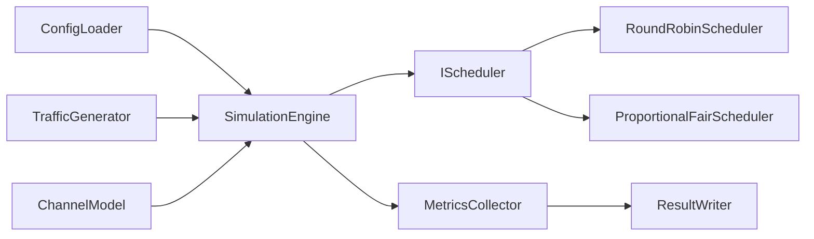

# 5G RAN Scheduling and Test Automation Simulator

This repository is an incremental portfolio project for practicing modern C++20,
Linux-compatible builds, automated testing, and CI/CD around simplified RAN L2/MAC
scheduling concepts.

> Educational limitation: this is a simplified simulator for learning and interview
> discussion. It is not a complete RAN implementation and is not 3GPP-compliant.

No proprietary Ericsson source code, algorithms, documentation, interfaces, or data are
used in this project.

## Current Phase

Phase 2 establishes the repository structure, CMake build, a minimal C++ library and
CLI, and a GoogleTest smoke test. Scheduling, traffic generation, metrics, Java
integration tests, JSON output, CSV output, and CI are planned but not implemented yet.

## Build And Test

```bash
cmake -S . -B build
cmake --build build
ctest --test-dir build --output-on-failure
./build/ran_scheduler
```

Optional sanitizer build on compatible GCC/Clang environments:

```bash
cmake -S . -B build-sanitized -DRAN_ENABLE_SANITIZERS=ON
cmake --build build-sanitized
ctest --test-dir build-sanitized --output-on-failure
```

## Planned Architecture

- `Packet`
- `UserEquipment`
- `TrafficGenerator`
- `ChannelModel`
- `IScheduler`
- `RoundRobinScheduler`
- `ProportionalFairScheduler`
- `SimulationEngine`
- `MetricsCollector`
- `ConfigLoader`
- `ResultWriter`

Schedulers are planned to return allocation decisions. The simulation engine will
validate and apply those decisions to UE queues.



## Roadmap

1. Repository structure and CMake build.
2. Core packet and UE queue models.
3. Traffic and channel models.
4. Round-Robin scheduler.
5. Simplified Proportional-Fair scheduler.
6. Metrics collection and result export.
7. Java/JUnit black-box integration tests.
8. GitHub Actions CI, formatting checks, and sanitizer builds.

## Development Note

AI-assisted engineering is being used for development and review. Features are added
incrementally and reviewed phase by phase, so the simulator is intentionally incomplete
at this stage.
