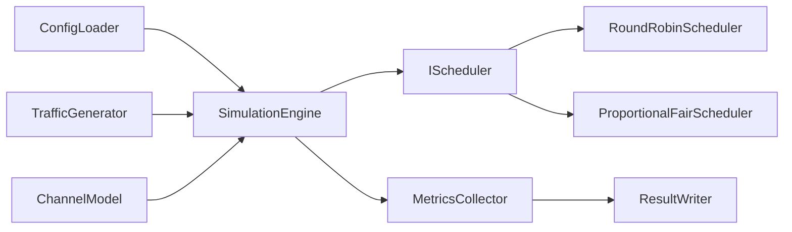

# 5G RAN Scheduling and Test Automation Simulator

This repository is an incremental portfolio project for practicing modern C++20,
Linux-compatible builds, automated testing, and CI/CD around simplified RAN L2/MAC
scheduling concepts.

> Educational limitation: this is a simplified simulator for learning and interview
> discussion. It is not a complete RAN implementation and is not 3GPP-compliant.

No proprietary Ericsson source code, algorithms, documentation, interfaces, or data are
used in this project.

## Current Phase

Phase 3 is complete. The project now includes value-owning packet and UE queue models,
plus JSON configuration loading and validation. The CLI can validate a configuration
and print a short summary.

Scheduling, traffic generation, changing channel conditions, simulation execution,
metrics, result files, Java integration tests, and CI are not implemented yet.

## Build And Test

```bash
cmake -S . -B build
cmake --build build
ctest --test-dir build --output-on-failure
./build/ran_scheduler --help
./build/ran_scheduler --config configs/basic.json
```

Optional sanitizer build on compatible GCC/Clang environments:

```bash
cmake -S . -B build-sanitized -DRAN_ENABLE_SANITIZERS=ON
cmake --build build-sanitized
ctest --test-dir build-sanitized --output-on-failure
```

## Current Models

`Packet` tracks a packet's original and remaining bytes, arrival slot, latency budget,
and simplified traffic category. `UserEquipment` owns a FIFO packet queue and basic
transmitted and dropped counters.

A packet uses this exact expiry rule:

```text
current_slot >= arrival_slot + latency_budget_slots
```

For example, a packet arriving in slot 0 with a latency budget of 3 can be served in
slots 0, 1, and 2, and expires before scheduling in slot 3.

The `voice`, `video`, and `download` categories and the values in `configs/basic.json`
are simplified educational labels and settings. They are not standardized 5G traffic
profiles or QoS flows.

## Planned Architecture

- `Packet`
- `UserEquipment`
- `TrafficGenerator`
- `ChannelModel`
- `IScheduler`
- `RoundRobinScheduler`
- `ProportionalFairScheduler`
- `SimulationEngine`
- `MetricsCollector`
- `ConfigLoader`
- `ResultWriter`

Schedulers are planned to return allocation decisions. The simulation engine will
validate and apply those decisions to UE queues.



## Roadmap

1. Complete: repository structure and CMake build.
2. Complete: core packet and UE queue models with JSON configuration.
3. Planned: traffic generation and changing channel models.
4. Planned: Round-Robin scheduler.
5. Planned: simplified Proportional-Fair scheduler.
6. Planned: metrics collection and result export.
7. Planned: Java/JUnit black-box integration tests.
8. Planned: GitHub Actions CI, formatting checks, and sanitizer builds.

## Development Note

AI-assisted engineering is being used for development and review. Features are added
incrementally and reviewed phase by phase, so the simulator is intentionally incomplete
at this stage.
