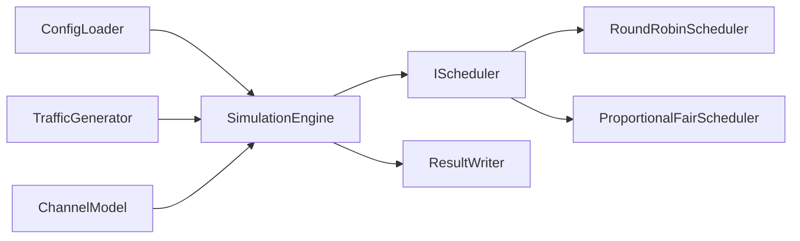

# 5G RAN Scheduling and Test Automation Simulator

This repository is an incremental portfolio project for practicing modern C++20,
Linux-compatible builds, automated testing, and CI/CD around simplified RAN L2/MAC
scheduling concepts.

> Educational limitation: this is a simplified simulator for learning and interview
> discussion. It is not a complete RAN implementation and is not 3GPP-compliant.

No proprietary Ericsson source code, algorithms, documentation, interfaces, or data are
used in this project.

## Current Phase

Phase 7 is complete. The project now runs deterministic end-to-end simulations with
traffic generation, channel updates, Round-Robin or simplified Proportional-Fair
scheduling, packet transmission, deadline drops, metrics, and JSON/CSV result files.

Java integration tests and CI are not implemented yet.

## Build And Test

```bash
cmake -S . -B build
cmake --build build
ctest --test-dir build --output-on-failure
./build/ran_scheduler --help
./build/ran_scheduler --config configs/basic.json \
  --scheduler round-robin --output-dir results/round-robin
./build/ran_scheduler --config configs/basic.json \
  --scheduler proportional-fair --output-dir results/proportional-fair
```

`--config` is required. The scheduler defaults to `round-robin`, and the output
directory defaults to `results`.

Optional sanitizer build on compatible GCC/Clang environments:

```bash
cmake -S . -B build-sanitized -DRAN_ENABLE_SANITIZERS=ON
cmake --build build-sanitized
ctest --test-dir build-sanitized --output-on-failure
```

## Current Models

`Packet` tracks a packet's original and remaining bytes, arrival slot, latency budget,
and simplified traffic category. `UserEquipment` owns a FIFO packet queue and basic
transmitted and dropped counters.

`TrafficGenerator` supports three simple models:

- `periodic` creates one packet when `slot % period_slots == 0`.
- `bernoulli` makes one seeded arrival decision per slot using a configured probability.
- `none` never creates packets or consumes random values.

For simplicity, `none` configurations still require the common packet size, latency
budget, and category fields, although the model does not use them.

`ChannelModel` supports three CQI models:

- `static` always returns the initial CQI.
- `trace` returns configured CQI values and holds the final value after the trace ends.
- `random_walk` changes CQI by -1, 0, or +1 and clamps it to configured limits.

Bernoulli traffic and random-walk CQI use `std::mt19937`. A fixed seed produces the same
sequence, which keeps tests and examples reproducible. The Bernoulli threshold and the
random-walk modulo operation are deliberately simple simulation abstractions.

A packet uses this exact expiry rule:

```text
current_slot >= arrival_slot + latency_budget_slots
```

For example, a packet arriving in slot 0 with a latency budget of 3 can be served in
slots 0, 1, and 2, and expires before scheduling in slot 3.

Completed-packet latency includes both its arrival and completion slots:

```text
latency in slots = completion slot - arrival slot + 1
```

A packet that arrives and completes in the same slot therefore has a latency of one.

The `voice`, `video`, and `download` categories and the values in `configs/basic.json`
are simplified educational labels and settings. They are not standardized 5G traffic
profiles or QoS flows.

All traffic and channel models are educational. They do not reproduce physical fading,
standardized radio-channel behavior, or real network traffic distributions.

## Round-Robin Scheduling

`IScheduler` is a small Strategy interface. `RoundRobinScheduler` implements that
contract by considering UEs in stable input order and allocating one resource block at a
time. Its cursor remembers which UE should be considered first on the next call, so a
slot with too few resource blocks does not always favor the first UE.

The scheduler receives read-only `UeSchedulingView` values containing UE ID, queued
bytes, CQI, and historical average throughput. It cannot modify packet queues. Instead,
it returns positive `ResourceAllocation` decisions in input order. The simulation engine
validates and applies those decisions.

UEs with empty queues are skipped. For active UEs, useful demand is estimated with:

```text
bytes per resource block = CQI * 100
required resource blocks = ceil(queued bytes / bytes per resource block)
```

The implementation calculates the ceiling with integer division and a remainder check.
This linear capacity rule is deterministic and easy to discuss, but it is not a 3GPP
transport-block or physical-layer capacity calculation.

## Proportional-Fair Scheduling

`ProportionalFairScheduler` uses current channel opportunity and historical service to
choose a UE for each resource block. Its simplified metric is:

```text
PF metric = bytesPerResourceBlock(CQI)
            / max(historical average throughput, epsilon)
```

CQI appears in the numerator, so a UE with a better current channel receives a higher
estimated rate. Historical average throughput appears in the denominator, so a UE that
has received less service can be preferred over a previously well-served UE. Epsilon is
positive and prevents division by zero when a UE has no throughput history.

Only UEs with useful queued demand are eligible. When scores are equal, the scheduler
prefers the UE with fewer resource blocks in the current call, then the lower UE ID. The
result is deterministic and prevents one equal-scoring UE from taking every resource
block.

The scheduler only reads historical throughput. `SimulationEngine` updates it after
transmission using this exponential moving average:

```text
T(t) = 0.9 * T(t-1) + 0.1 * transmittedBytes(t)
```

This PF model is an educational approximation, not an exact production or 3GPP
scheduler.

## Simulation Loop

For each time slot, `SimulationEngine` performs the following operations in order:

1. Generate packets for each UE and add them to its queue.
2. Remove packets that have reached their latency deadline.
3. Update each UE's CQI from its channel model.
4. Build read-only scheduling views and ask the selected scheduler for allocations.
5. Validate allocations before applying any of them.
6. Transmit `allocated resource blocks * bytesPerResourceBlock(current CQI)` bytes.
7. Update every UE's historical average throughput.
8. Record per-UE and per-slot metrics.

The simulation seed and UE ID are combined into separate deterministic traffic and
channel seeds. Repeating a run with the same configuration and scheduler produces the
same metrics and output files.

## Metrics And Results

Per-UE metrics include generated packets and bytes, completed packets, transmitted
bytes, dropped packets and remaining bytes, allocated resource blocks, average bytes
transmitted per slot, average completed-packet latency, and nearest-rank 95th-percentile
completed-packet latency. Latencies are zero when no packets complete.

Overall metrics include generated, transmitted, and dropped bytes; allocated and
available resource blocks; resource-block utilization; and Jain's fairness index based
on per-UE average throughput. Utilization is allocated blocks divided by available
blocks. Jain's index is zero when every UE has zero throughput.

Each run creates these deterministic files in the selected output directory:

- `summary.json`: overall metrics and the complete per-UE metrics array.
- `per_ue.csv`: one row of accumulated and derived metrics per UE.
- `per_slot.csv`: generated, transmitted, and dropped bytes plus allocated blocks per
  slot.

## Planned Architecture

- `Packet`
- `UserEquipment`
- `TrafficGenerator`
- `ChannelModel`
- `IScheduler`
- `RoundRobinScheduler`
- `ProportionalFairScheduler`
- `SimulationEngine`
- `ConfigLoader`
- `ResultWriter`

Schedulers return allocation decisions. The simulation engine validates and applies
those decisions to UE queues before collecting metrics and writing results.



## Roadmap

1. Complete: repository structure and CMake build.
2. Complete: core packet and UE queue models with JSON configuration.
3. Complete: traffic generation and changing channel models.
4. Complete: Round-Robin scheduler.
5. Complete: simplified Proportional-Fair scheduler.
6. Complete: simulation engine, metrics collection, and result export.
7. Planned: Java/JUnit black-box integration tests.
8. Planned: GitHub Actions CI, formatting checks, and sanitizer builds.

## Development Note

AI-assisted engineering is being used for development and review. Features are added
incrementally and reviewed phase by phase, so the simulator is intentionally incomplete
at this stage.
